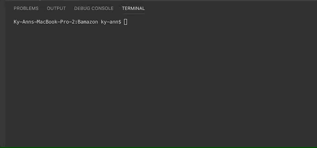
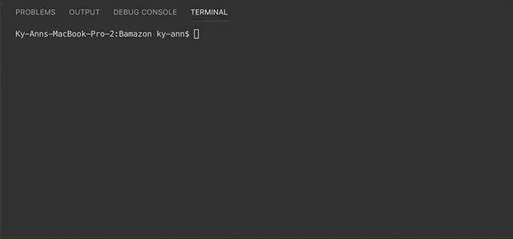
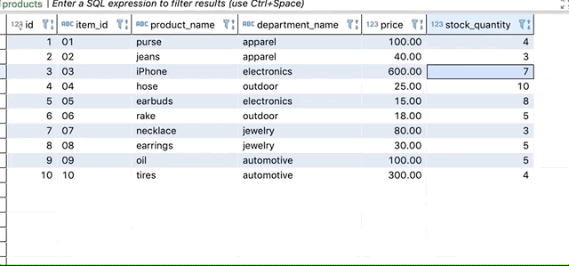

# Bamazon
This is an app which houses product data for an online store. It uses dBeaver, Mamp and node applications to function.

## Not Enough Inventory
This giphy demonstrates the products with id key, id number, product name, department name and stock quantity. The buyer is prompted for the id of the product they would like to buy. If the buyer orders more than is present in stock, message "insufficient quanity" displays. 

## Inventory Demand Met
This giphy demonstrates the same table and prompt when the buyer has enough inventory to meet their request. The return message shows the item id, "table updated" and that one row has changed.

## Table Changes
This giphy demonstrates the table decreasing by the amount requested. 

